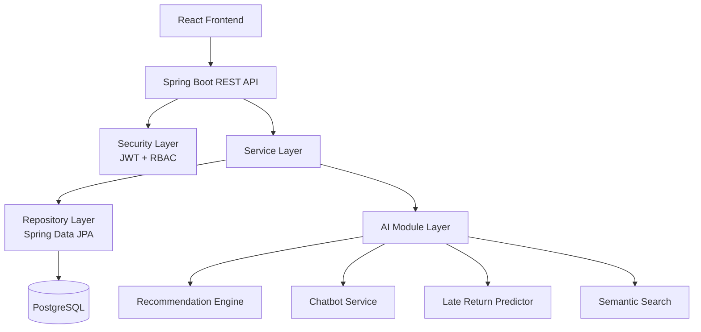

# System Architecture Diagram

```mermaid
flowchart TB
  UI[React Frontend] --> API[Spring Boot REST API]
  API --> SEC[Security Layer\nJWT + RBAC]
  API --> SVC[Service Layer]
  SVC --> REPO[Repository Layer\nSpring Data JPA]
  REPO --> DB[(PostgreSQL)]
  SVC --> AI[AI Module Layer]
  AI --> REC[Recommendation Engine]
  AI --> CHAT[Chatbot Service]
  AI --> RISK[Late Return Predictor]
  AI --> SEM[Semantic Search]
```
