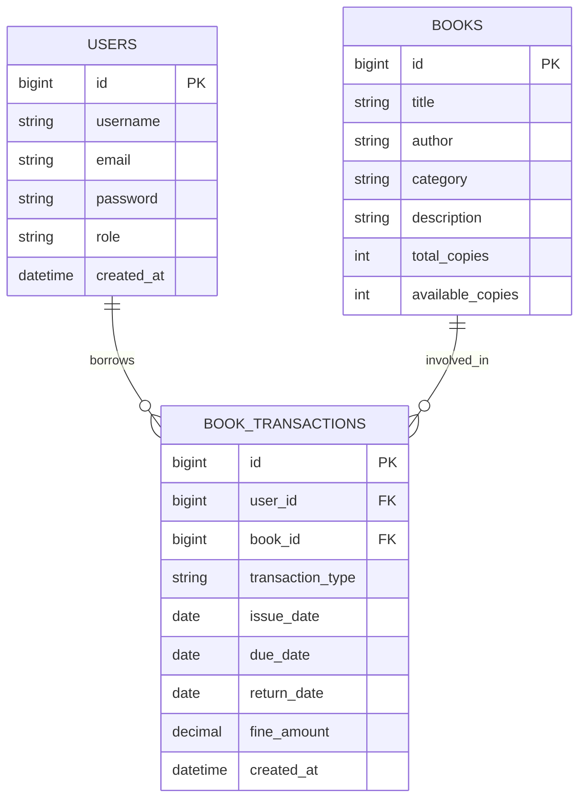

# ER Diagram

```mermaid
erDiagram
  USERS ||--o{ BOOK_TRANSACTIONS : borrows
  BOOKS ||--o{ BOOK_TRANSACTIONS : involved_in

  USERS {
    bigint id PK
    string username
    string email
    string password
    string role
    datetime created_at
  }

  BOOKS {
    bigint id PK
    string title
    string author
    string category
    string description
    int total_copies
    int available_copies
  }

  BOOK_TRANSACTIONS {
    bigint id PK
    bigint user_id FK
    bigint book_id FK
    string transaction_type
    date issue_date
    date due_date
    date return_date
    decimal fine_amount
    datetime created_at
  }
```
