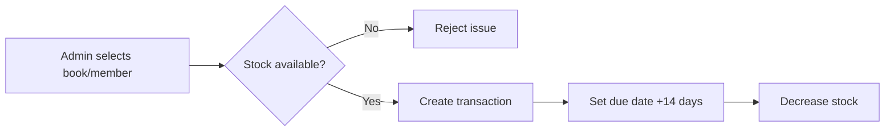
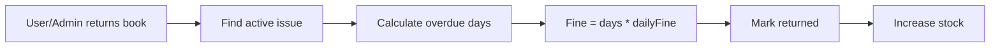

# Core Flowcharts

## Issue Flow

```mermaid
flowchart LR
  A[Admin selects book/member] --> B{Stock available?}
  B -- No --> C[Reject issue]
  B -- Yes --> D[Create transaction]
  D --> E[Set due date +14 days]
  E --> F[Decrease stock]
```

## Return Flow

```mermaid
flowchart LR
  A[User/Admin returns book] --> B[Find active issue]
  B --> C[Calculate overdue days]
  C --> D[Fine = days * dailyFine]
  D --> E[Mark returned]
  E --> F[Increase stock]
```
